```mermaid
graph LR
    %% --- Style Configurations ---
    classDef userBox fill:#1e293b,stroke:#3b82f6,stroke-width:2px,color:#fff;
    classDef pipeBox fill:#1e1b4b,stroke:#6366f1,stroke-width:2px,color:#fff;
    classDef microBox fill:#2e1065,stroke:#a855f7,stroke-width:2px,color:#fff;
    classDef extBox fill:#1c1917,stroke:#78716c,stroke-width:2px,color:#fff;
    classDef dataBox fill:#062f4f,stroke:#0284c7,stroke-width:2px,color:#fff;
    classDef infraBox fill:#14532d,stroke:#22c55e,stroke-width:2px,color:#fff;
    
    %% --- LAYER 1: USERS & DEVICES ---
    subgraph UsersDevices ["Users & Devices"]
        direction TB
        Web[Web App]
        Mobile[Mobile App]
        TV[Smart TV]
        Console[Gaming Console]
    end
    class UsersDevices,Web,Mobile,TV,Console userBox;

    %% --- LAYER 2: VIDEO DELIVERY (DATA PLANE) ---
    subgraph VideoPipeline ["Video Delivery Pipeline"]
        direction TB
        Encoding[Encoding & Transcoding] --> Storage[Object Storage]
        Storage -.->|Origin| CDN[Content Delivery Network]
        CDN --> ABR[Adaptive Bitrate Streaming]
    end
    class VideoPipeline,Encoding,Storage,CDN,ABR pipeBox;

    %% --- LAYER 3: CORE SERVICES (CONTROL PLANE) ---
    subgraph Microservices ["Backend Microservices"]
        direction TB
        Auth[Authentication Service]
        UserServ[User Service]
        ContentServ[Content Service]
        SearchServ[Search Service]
        RecServ[Recommendation Service]
        PlaybackServ[Playback Service]
        AnalyticsServ[Analytics Service]
    end
    class Microservices,Auth,UserServ,ContentServ,SearchServ,RecServ,PlaybackServ,AnalyticsServ microBox;

    %% --- LAYER 4: EXTERNAL DEPENDENCIES ---
    subgraph External ["External Services"]
        direction TB
        OAuth[OAuth / SSO]
        Payment[Payment Gateway]
        Notify[Email / Notifications]
    end
    class External,OAuth,Payment,Notify extBox;

    %% --- LAYER 5: PERSISTENCE & DATA LAYER ---
    subgraph DataCache ["Data & Cache Layer"]
        direction TB
        RecDB[(Recommendation DB)]
        UserDB[(User Database)]
        ContentDB[(Content Database)]
        Redis[(Redis Cache)]
    end
    class DataCache,RecDB,UserDB,ContentDB,Redis dataBox;

    %% --- LAYER 6: BASE INFRASTRUCTURE ---
    subgraph Infra ["Cloud Infrastructure"]
        direction TB
        WAF[WAF / Security]
        K8s[Containers]
        Scaling[Auto Scaling]
        Logs[Logs & Metrics]
    end
    class Infra,K8s,Scaling,Logs,WAF infraBox;

    %% --- ARCHITECTURE CONNECTIONS ---
    
    %% User Inputs flowing left to right
    UsersDevices ===>|1. API Traffic| Auth
    UsersDevices ===>|2. User Actions| AnalyticsServ
    
    %% Internal Logic
    Auth --> PlaybackServ
    
    %% Services writing to Data Layer
    RecServ ----> RecDB
    UserServ ----> UserDB
    ContentServ ----> ContentDB
    ContentServ ----> Redis
    SearchServ ----> Redis
    
    %% External Plugins
    Auth <--> OAuth
    UserServ <--> Payment
    UserServ <--> Notify

    %% Video Streams Delivery Flow
    PlaybackServ -.->|Authorize Token| CDN
    ABR ===>|Smooth Video Stream| UsersDevices

    %% Enforce spatial separation from left to right
    Infra ~~~ DataCache
    DataCache ~~~ External
    External ~~~ Microservices
    Microservices ~~~ VideoPipeline
    VideoPipeline ~~~ UsersDevices
```

# Experiment 2: Netflix High-Level Architecture Design
**Date:** September 16, 2026

This experiment explores the architecture blueprint of a high-concurrency video streaming platform. The design completely decouples the Control Plane from the Data Plane to ensure smooth video delivery under massive user traffic loads.

## Documentation Index
1. [Functional & Non-Functional Requirements](docs/1-requirements.md)
2. [Data Model & Database Schema](docs/2-db-schema.md)
3. [Core API Specifications](docs/3-endpoints.md)
4. [System Scale Estimation Models](docs/4-estimation.md)

---

## High-Level Architecture Diagram

---

## High-Level Architecture Diagram

Here is the finalized spatial architecture blueprint for the system design submission:

